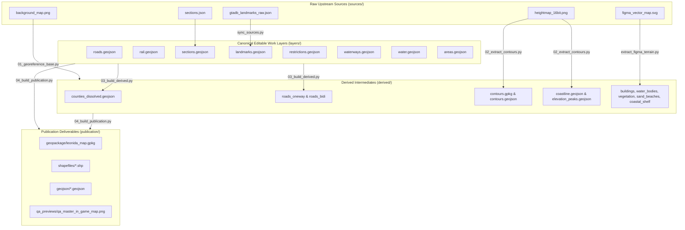

# State of Leonida GIS — Data Sources & Lineage Specification

This document details all upstream source datasets, georeferencing parameters, transformation formulas, and cartographic symbology specifications for the State of Leonida GIS project.

---

## 1. Master Dataset Provenance

| Dataset / Asset | Local Path | Source / Author | Format | Resolution / Count | CRS / Extents |
|---|---|---|---|---|---|
| **In-Game Satellite Basemap** | [`rasters/background_map.png`](file:///C:/Users/kanal/Downloads/Projects/leonida_gis/rasters/background_map.png) | In-Game Aerial Imagery | 8-bit RGB PNG + `.pgw` | $2590 \times 3240\text{ px}$ ($5.6362\text{ m/px}$) | `EPSG:4087` (SW: $-10721.65, -8557.13$ \| NE: $+3876.15, +9704.21$) |
| **16-Bit DEM Heightmap** | [`rasters/heightmap_16bit.png`](file:///C:/Users/kanal/Downloads/Projects/leonida_gis/rasters/heightmap_16bit.png) | Community DEM extraction | 16-bit Grayscale PNG | $2150 \times 2736\text{ px}$ ($12.0165\text{ m/px}$) | `EPSG:4087` ($0.0\text{ m}$ sea level to $+800.0\text{ m}$ summit) |
| **GTADB POIs & Amenities** | [`sources/gtadb_landmarks_raw.json`](file:///C:/Users/kanal/Downloads/Projects/leonida_gis/sources/gtadb_landmarks_raw.json) | rolux / [gtadb.org](https://gtadb.org) | JSON | 2,318 curated points | In-game metric coordinates + Florida WGS 84 GPS |
| **Community Vector Map** | [`sources/figma_vector_map.svg`](file:///C:/Users/kanal/Downloads/Projects/leonida_gis/sources/figma_vector_map.svg) | GTA VI Community Mapping Project | SVG ($98.9\text{ MB}$) | 2,152 buildings, 1,869 water bodies, 1,752 vegetation, 350 beaches | Figma canvas ($21001 \times 20000\text{ px}$) |
| **Administrative Sections** | [`sources/sections.json`](file:///C:/Users/kanal/Downloads/Projects/leonida_gis/sources/sections.json) | Community Mapping Project | GeoJSON FeatureCollection | 92 sections across 5 counties | In-game metric coordinates (`EPSG:4087`) |
| **Rail Transit Alignments** | [`sources/rail.svg`](file:///C:/Users/kanal/Downloads/Projects/leonida_gis/sources/rail.svg) | Community Vector Tracing | SVG vector geometry | Mainline heavy rail and light rail corridors | In-game metric coordinates (`EPSG:4087`) |

---

## 2. Coordinate Reference System & Spatial Bounds

### 2.1 Projected CRS Specification
* **Identifier:** `EPSG:4087` (World Equidistant Cylindrical / Equirectangular).
* **Projection Definition:** `+proj=eqc +lat_ts=0 +lat_0=0 +lon_0=0 +x_0=0 +y_0=0 +datum=WGS84 +units=m +no_defs`
* **Coordinate Units:** Meters ($1.00\text{ unit} = 1.00\text{ meter}$).
* **Origin:** $(0.00, 0.00)\text{ m}$ located at the center of the coordinate system.
* **Coordinate Precision:** Stored to 2 decimal places ($0.01\text{ m} = 1\text{ cm}$).

### 2.2 Project Extents
* **South-West Corner:** $X = -10721.65\text{ m}, \quad Y = -8557.13\text{ m}$
* **North-East Corner:** $X = +3876.15\text{ m}, \quad Y = +9704.21\text{ m}$
* **Total Bounding Dimensions:** Width $\approx 14.60\text{ km}$, Height $\approx 18.26\text{ km}$

### 2.3 Reprojection to WGS 84 (`EPSG:4326`)
Reprojection to geographic latitude and longitude uses standard Equirectangular inverse formulas with $R = 6,378,137\text{ m}$ and $\text{lat\_ts} = 0^\circ$:
$$\text{Lon} = \frac{X}{R}, \quad \text{Lat} = \frac{Y}{R}$$

---

## 3. Georeferencing & Transformation Parameters

### 3.1 In-Game Satellite Basemap Raster
The in-game aerial basemap ([`rasters/background_map.png`](file:///C:/Users/kanal/Downloads/Projects/leonida_gis/rasters/background_map.png)) is georeferenced via ESRI world files ([`background_map.pgw`](file:///C:/Users/kanal/Downloads/Projects/leonida_gis/rasters/background_map.pgw), [`background_map.wld`](file:///C:/Users/kanal/Downloads/Projects/leonida_gis/rasters/background_map.wld)):
$$\begin{aligned}
\Delta X &= +5.6362162162\text{ m/px} \\
\Delta Y &= -5.6362160494\text{ m/px} \\
X_0 &= -10721.650000\text{ m} \\
Y_0 &= +9704.211000\text{ m}
\end{aligned}$$

### 3.2 16-Bit Digital Elevation Model (DEM)
The elevation heightmap ([`rasters/heightmap_16bit.png`](file:///C:/Users/kanal/Downloads/Projects/leonida_gis/rasters/heightmap_16bit.png)) maps 16-bit integer values $[0, 65535]$ to elevation in meters above sea level:
$$Z_{\text{raw}} = 28150.0 + (\text{elevation\_m} \times 46.51)$$
* **Sea Level ($0.0\text{ m}$):** $Z_{\text{raw}} = 28,150$
* **Mount Kalaga Summit ($800.0\text{ m}$):** $Z_{\text{raw}} = 65,358$
* **Affine Transform:** $X_0 = -13318.10$, $Y_0 = +11265.42$, $\Delta X = +12.0165\text{ m/px}$, $\Delta Y = -12.0165\text{ m/px}$

### 3.3 Figma Vector SVG Canvas
Polygonal landcover layers extracted from [`sources/figma_vector_map.svg`](file:///C:/Users/kanal/Downloads/Projects/leonida_gis/sources/figma_vector_map.svg) by [`scripts/extract_figma_terrain.py`](file:///C:/Users/kanal/Downloads/Projects/leonida_gis/scripts/extract_figma_terrain.py) use the following affine transformation from SVG pixels to metric coordinates:
$$\begin{aligned}
X_{\text{geo}} &= x_{\text{svg}} - 17000.0 \\
Y_{\text{geo}} &= 11000.0 - y_{\text{svg}}
\end{aligned}$$

---

## 4. Topography & Elevation Symbology

To ensure high visual contrast against the in-game satellite aerial basemap and hillshaded relief, elevation contours use an amber color specification:

| Feature Class | Filter Expression | Color (RGBA) | Width | Opacity | Scale Constraint |
|---|---|:---:|:---:|:---:|:---:|
| **Major Index Contours** | `"is_index" = 1 OR "is_index" = true` | `230, 144, 0, 255` (`#E69000`) | $0.45\text{ mm}$ | $95\%$ | Visible $\le 1:150,000$ |
| **Intermediate Contours** | `"is_index" = 0 OR "is_index" = false OR "is_index" IS NULL` | `255, 176, 0, 255` (`#FFB000`) | $0.20\text{ mm}$ | $75\%$ | Visible $\le 1:150,000$ |
| **Elevation Text Labels** | — | `184, 104, 0, 255` (`#B86800`) | $7.5\text{ pt}$ Bold | $100\%$ | Visible $\le 1:2,000$ (with $0.7\text{ mm}$ white halo) |

* **Quantile Distribution:** Contours are extracted at 27 empirical quantile levels ($0.5\text{ m}$ to $650.7\text{ m}$) rather than fixed 50m intervals, accurately capturing subtle lowland terrain variations where 75% of Leonida's land area lies below $53\text{ m}$.

---

## 5. Repository Processing Architecture

---

## 6. Maintenance & Updates

* **Sync Landmarks:** Run `python scripts/sync_sources.py` to refresh GTADB landmark data from gtadb.org.
* **Update Landcover:** If `sources/figma_vector_map.svg` is updated, run `python scripts/extract_figma_terrain.py` to regenerate building footprints and landcover boundaries.
* **Build Deliverables:** Run `python scripts/run_pipeline.py` to update all derived datasets and publication deliverables.
* **Validation:** Run `python scripts/validate.py --strict` to verify schema compliance and topological constraints before committing changes.
